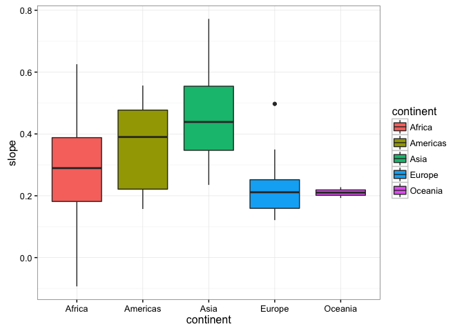
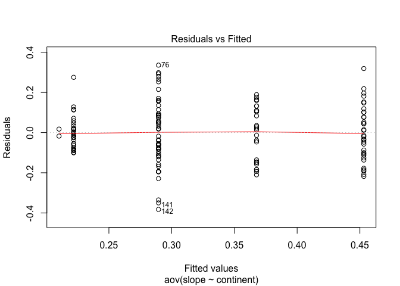
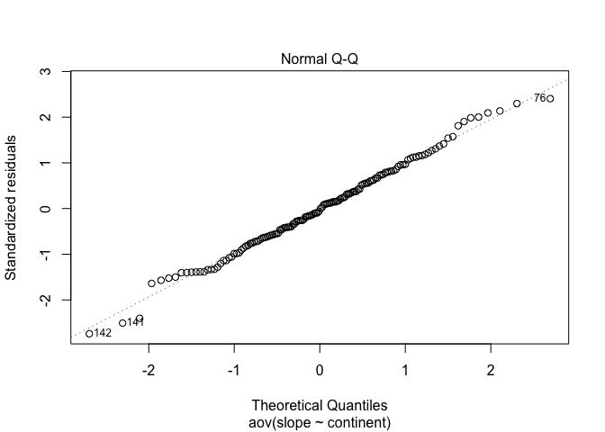
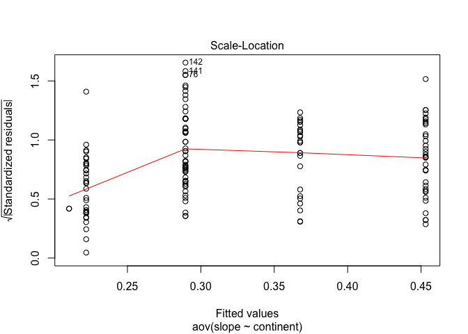
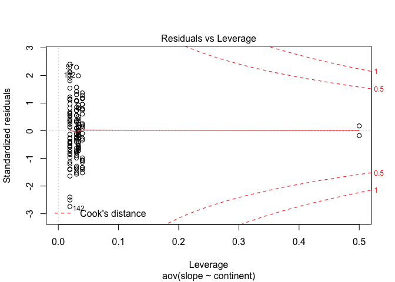

# Data Exploration
Dustin Johnson  
2/10/2017  

For this week, we will begin to put everything we've learned together! Let me begin by painting the picture for you...

Say you are interested in developing some sort of model for each country in your large time-series data set, Gapminder. Thinking about this generally, it would make sense to _split_ the data into seperate data.frames by country, then apply your model to each data.frame. You will then have a set of parameters for each data.frame you fit (one set of parameters for each country), which you would like to combine back together into its own unique data.frame. This is exactly what the $do()$ function does in dplyr! Let's give it a try.

We begin developing the function of interest. In our case, this will be a simply linear model with an a slope and intercept parameters. We will be interested in regressing the life expectancy to year for each country.


```r
# import required libraries
library(gapminder)
library(plyr)
library(dplyr)
library(ggplot2)

# construct linear model
mod <- function(dat, offset = 1952)
{
	linear.model <- lm(lifeExp ~ I(year - offset), dat)
	lm.out <- setNames(coef(linear.model), c("intercept", "slope"))
	return(lm.out)
}
```


Once our model has been constructed, let's test this against a single country to see how it works. If this was extremely large, expensive data, testing our model on a small subset is always a quick and easy sanity check.


```r
# filter subset Canada
cda <- gapminder %>%
	filter(country == "Canada")

# run model
mod(cda)
```

```
##  intercept      slope 
## 68.8838462  0.2188692
```

So far, so good! Now, let's extend this to the entire data set! In order to do so, let's use the do function to extract the slope and intercept parameters from the `mod()` function output.


```r
# apply mod with the do function to each group
gDat <- gapminder %>%
	select(lifeExp, continent, country, year) %>%
	group_by(country) %>%
	do(
		intercept = mod(.)[1],
		slope = mod(.)[2]
		) %>% 
	data.frame()

# intercept and slope are in lists, so coerce
# to data.frames using ldply() from package plyr
gDat <- data.frame(country = gDat$country, 
									 ldply(gDat$intercept), 
									 ldply(gDat$slope))

head(gDat)
```

```
##       country intercept     slope
## 1 Afghanistan  29.90729 0.2753287
## 2     Albania  59.22913 0.3346832
## 3     Algeria  43.37497 0.5692797
## 4      Angola  32.12665 0.2093399
## 5   Argentina  62.68844 0.2317084
## 6   Australia  68.40051 0.2277238
```

We may now be interested in joining our original data set with our new gDat so we can have a continent column onto our new gDat data.frame, therefore having a continent identifier for each country. Let's first attempt this with [joins and merges](https://qph.ec.quoracdn.net/main-qimg-c4c89a0773045e9e115e15d550f2c150-c). 

Let's think about what we really want. We want our data set gDat to join with a data table and extract take with in only the column "continent" based on the unique identifier "country". That sounds like an inner join to me! A unique identifier is a column that is unique to both tables, that enables you to join. Let's first create a join table containing only the information we need. This is necessary, as in the case of big data, joining two large data sets involves an extensive amount of searching and matching.


```r
# index table with which to join
join.table <- gapminder %>%
	select(country, continent) %>%
	group_by(country, continent) %>%
	summarise(counts = n()) %>%
	select(-counts)

head(join.table)
```

```
## Source: local data frame [6 x 2]
## Groups: country
## 
##       country continent
## 1 Afghanistan      Asia
## 2     Albania    Europe
## 3     Algeria    Africa
## 4      Angola    Africa
## 5   Argentina  Americas
## 6   Australia   Oceania
```

```r
# join tables and reorder columns
gDat.joined <- inner_join(gDat, join.table, by = "country") %>%
	select(continent, country, intercept, slope)

head(gDat.joined)
```

```
##   continent     country intercept     slope
## 1      Asia Afghanistan  29.90729 0.2753287
## 2    Europe     Albania  59.22913 0.3346832
## 3    Africa     Algeria  43.37497 0.5692797
## 4    Africa      Angola  32.12665 0.2093399
## 5  Americas   Argentina  62.68844 0.2317084
## 6   Oceania   Australia  68.40051 0.2277238
```

Our join worked magically! Now we can perform analysis of the model parameters by continent, where each continent will have a sample of coeficients. Let's examine this with a boxplot.


```r
ggplot(gDat.joined, aes(y = slope, x = continent, fill = continent)) +
	geom_boxplot() +
	theme_bw()
```

 

Is there a significance difference between the rate of change of life expectancy (mean slope coeffecient of life expectancy over time) of at least one continent? Perform your trusty ANOVA!


```r
fit <- aov(slope ~ continent, gDat.joined)
summary(fit)
```

```
##              Df Sum Sq Mean Sq F value Pr(>F)    
## continent     4 0.9975 0.24938   12.55  1e-08 ***
## Residuals   137 2.7228 0.01987                   
## ---
## Signif. codes:  0 '***' 0.001 '**' 0.01 '*' 0.05 '.' 0.1 ' ' 1
```

There is sufficient evidence to conclude that a significant difference exists between the slope parameters by continent. Examine the plots to determine whether the assumptions are reasonable.


```r
plot(fit)
```

    

Use your t-tests to examine where this difference exists. I will leave this up to you! Just recollect your previous Malaria case study.
