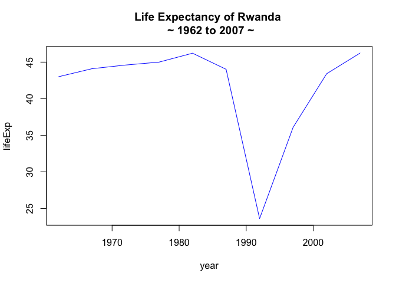

# STAT 450 Seminar Material
Dustin Johnson  
January 7, 2017  

Hello STAT 450 folk! This repo will contain the material and tasks covered in the seminar. Do your best to stay up-to-date and visit connect to access the seminar slides.

### Table of Contents
1. [Tasks and Challenges](#tasks)
	* [Task 1](#jan12)
	* [Task 2](#jan19)
2. [Seminar Material](#material)
	* [Week 1](#jan5)


---


### Tasks and Challenges <a name="tasks"></a>

---

##### Complete by: January 12, 2017 <a name="jan12"></a>

* Using the Gapminder dataset, please complete the following for the next seminar:
	* determine the rate of change of lifeExp, pop, or gdpPerCap for two countries
	* plot these rates of change again each other and comment on the results
	* comment on the statistical limitations of your results and possible remedies
	
##### Complete by: January 19, 2017 <a name="jan19"></a>
1. Create STAT_450 repository on your personal Github account
2. Get familiar with the R and Git routine by following the tutorial [here](https://www.r-bloggers.com/rstudio-and-github/).
3. First, get familiar with [Markdown](http://www.markdowntutorial.com/). Then, in the STAT_450 repo, initiate a README.md that includes the following:
	* Description about yourself
	* Photo of yourself or something that interests you
	* Description of what you aim to take away from STAT 450
4. Begin populating your STAT_450 repo with material and tasks you have completed so far. For instance, you should have a folder called Week1_Seminar, where you will place the Gapminder task completed the previous week. In this repo, initialize another README.md that interprets your results of the task. Follow the format I used below (code, plot, description).
5. Stay organized!

	

### Seminar Material <a name="material"></a>

---

#### January 5, 2016 <a name="jan5"></a>

For our first seminar, the following was covered (please refer to slides on connect):

1. Setting up and getting familiar with R and R Studio.
2. Reading and writing (IO)
3. Data structures in R (matrices, vectors, data.frames, lists)
4. Data types in R (numeric, integer, string/character, factor)
5. R logical operators (>, < , ==, etc.)
6. Examining data upon import
7. Extracting information and data from data.frames

We will walk through the process with an applied example using the Gapminder data set. Firstly, we are required to import the data. Conveniently, the data can be retrieved from [CRAN](https://cran.r-project.org/doc/FAQ/R-FAQ.html#What-is-CRAN_003f).


```r
# uncomment if you haven't installed gapminder yet.
#install.packages('gapminder')

library(gapminder)
```

We can examine the structure of the data using the built-in R functions below. I find `head()` and `str()` to be quite useful, as they capture nearly all the information regarding the data. Try to answer the following questions:

1. What are the dimensions of the data?
2. What is the data structure? (data.frame, matrix, etc.) 
3. What are the variable names and data types? (int, num, chr, etc)
4. Can you explain what the data is that you are attempting to investigate?


```r
head(gapminder); tail(gapminder)
nrow(gapminder); ncol(gapminder)
dim(gapminder)
```


```r
str(gapminder)
```

```
## Classes 'tbl_df', 'tbl' and 'data.frame':	1704 obs. of  6 variables:
##  $ country  : Factor w/ 142 levels "Afghanistan",..: 1 1 1 1 1 1 1 1 1 1 ...
##  $ continent: Factor w/ 5 levels "Africa","Americas",..: 3 3 3 3 3 3 3 3 3 3 ...
##  $ year     : int  1952 1957 1962 1967 1972 1977 1982 1987 1992 1997 ...
##  $ lifeExp  : num  28.8 30.3 32 34 36.1 ...
##  $ pop      : int  8425333 9240934 10267083 11537966 13079460 14880372 12881816 13867957 16317921 22227415 ...
##  $ gdpPercap: num  779 821 853 836 740 ...
```

Once we know something about the data, we can begin to examine it more closely. Let's plot lifeExp from 1960 to 2007 for the country Rwanda. I'll leave it up to you to interpret.


```r
# rename object
gDat <- gapminder

# extract information - keep object names clear
# extract values from data.frame using [row index, column index]
# row index and column index could be names or integer values
# c() function create a vector that concatenates integers or names
# what does gDat$country == 'Rwanda' return?
gDat.lifeExp.Rwanda <- gDat[gDat$country == 'Rwanda',c('lifeExp', 'year')]
gDat.lifeExp.Rwanda.yearTrim <- gDat.lifeExp.Rwanda[gDat$year >= 1960,]

# plot the data
plot(lifeExp ~ year, 
		 data = gDat.lifeExp.Rwanda.yearTrim, 
		 type = "l", 
		 main = "Life Expectancy of Rwanda \n ~ 1962 to 2007 ~",
		 col = "blue")
```

 

Let's say we are interested in the rate of change of gdpPerCap for Rwanda We can apply functions to vectors and transform the data to the desired format and combine the results to the original data.frame using `cbind()` or `data.frame()`:


```r
# create a function to compute the rate of change
deltaCompute <- function(x)
{
	x.lag <- Hmisc::Lag(x) # what does the function lag() do?
	x.diff <- x - x.lag
	x.delta <- x.diff/x.lag

	return(x.delta)
}

# extract only the data we need
gDat.rwanda <- gDat[gDat$country == 'Rwanda',c('continent','year', 'gdpPercap')]

# use our function to compute the delta of gdpPercap
gDat.rwanda.delta <- deltaCompute(as.numeric(gDat.rwanda$gdpPercap))

# combine into original gDat.rwanda data.frame
gDat.rwanda.df <- data.frame(gDat.rwanda, Delta = gDat.rwanda.delta)

# plot results
plot(Delta ~ year, 
		 data = gDat.rwanda.df[-1,], 
		 main = "Annual Change of GDP per Capita for Rwanda",
		 type = "l",
		 col = "blue")
```

 

