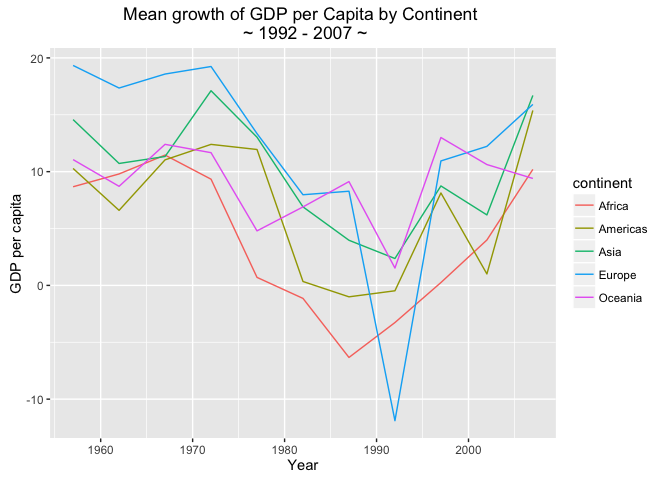
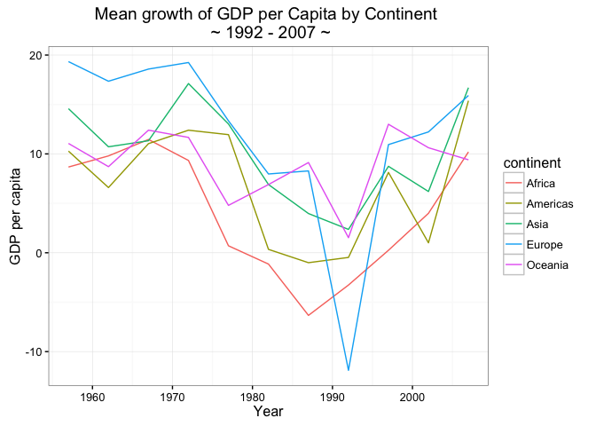

# Data Visualization
Dustin  
2/10/2017  

So we can manipulate data and attempt to find some patterns, but visualisations make the much easier. It also makes a large difference when presenting your findings to a group of clients or your boss. This week we will delve into ggplot2, rCharts and if all goes well, Shiny! 

<br>

### <font color="orange">ggplot2</font>  <a name="ggplot2"></a>
By the same creator of your favourite dplyr package, ggplot2 easily extends your wrangled data.frames to eye-pleasing visualisations. The syntax is quite simple:

<font size=5>
**`myPlot <- ggplot(data.frame.object, aes(x = ?, y = ?, ...)) + ...`**
</font>

1. Think of a descriptive plot name (myPlot is not!)
	* let's say `asia.lifeExp.perYear`
<br><br>
2. Input some data.frame object in [long form](http://stackoverflow.com/questions/5877234/r-transforming-short-form-data-to-long-form-data-without-for-loops)
<br><br>
3. Specify aesthetics, which you can think of as the properties required to construct your plot (x, y, colour, etc). Multiple aesthetics can add other dimensions of information to the plot.
	* `asia.lifeExp.perYear <- ggplot(df, aes(x = year, y = lifeExp, colour = country))`
<br><br>
4. Add layers - layers are known as **geoms**
	* `asia.lifeExp.perYear_2 <- asia.lifeExp.perYear + geom_line() + ggtitle("your title")`
	* There are many different geom layers you can choose from (points, lines, densityies, ...). Check them all out [here](http://docs.ggplot2.org/current/).
	* Remember to `?` the geom of your chose to understand more about it!
<br><br>
5. Save that plot to a directory
	* Once your plot is ready-to-go, save it to a directory and use it wherever you like: `ggsave(your_plot_name, filename = "the filename of the plot")`

<br>

#### Challenge: Can you find which continent has the lowest mean growth of GDP per Capita in 1992? <a name="challenge_ggplot"></a>

Let's extend the question from week 2, but this time, let's answer the question with a ggplot visual!


```r
# load library
library(ggplot2)

# wrangle that data with dplyr and group
# settings will extend to the plot!
gdp.delta.new <- gapminder %>%
    select(year, continent, country, gdpPercap) %>%
    mutate(change = 100*((gdpPercap - lag(gdpPercap)))/gdpPercap) %>%
    filter(year > 1952) %>%
    group_by(continent, year) %>%
		summarise(mean.growth = mean(change))

# construct the plot frame
plot.frame <- ggplot(gdp.delta.new, aes(x = year, y = mean.growth))

# add a point layer
plot2 <- plot.frame + geom_line(aes(colour = continent))

# add axis labels and a title
plot3 <- plot2 + 
	ggtitle("Mean growth of GDP per Capita by Continent \n ~ 1992 - 2007 ~") +
	xlab("Year") + ylab("GDP per capita")

# print the plot
print(plot3)
```

 

We can now simply say that the largest drop in mean growth occurred in Europe in 1992 without looking at a bunch of data! Although, it's best to accompany your plot with a data table. So, now you can answer the question of what caused this drop in the first place... any ideas?

We can make the plot look even prettier or simplistic or adjust the legend by adjusting the themes.


```r
# remove the clutter
plot4 <- plot3 + theme_bw()
print(plot4)
```

 

Please follow along with the following examples and tutorials to improve those ggplot skills:

* Try these [ggplot challenges](https://htmlpreview.github.io/?https://github.com/AQM-UBC/CourseMaterial/blob/master/Week3_Visualisation/ggplot_challenges.html)
* Check out the [ggplot2 graphics cookbook](http://www.cookbook-r.com/Graphs/index.html)
* Keep things interesting with ggplot2 [themes](http://docs.ggplot2.org/dev/vignettes/themes.html)
* A bunch of tutorials on [different types of visualisations with ggplot2](http://docs.ggplot2.org/current/)
* Of course, [Google](google.ca) and [Stack Overflow](http://stackoverflow.com/tags/ggplot2) will have most of your answers

<br>
